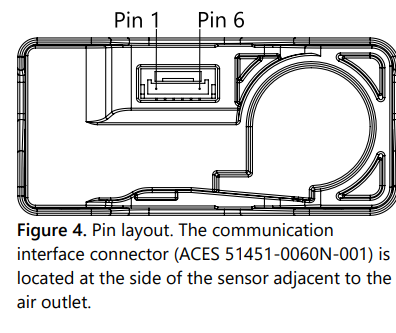

# Sensirion Raspberry Pi I²C SEN68 Driver

The repository provides a driver for setting up a SEN68 sensor to run on a Raspberry Pi over I²C.


Click [here](https://sensirion.com/sen6x-air-quality-sensor-platform) to learn more about the Sensirion SEN68 sensor.


The default I²C address of [SEN68](https://www.sensirion.com/products/catalog/SEN68) is **0x6B**.


## Connect the sensor

Your sensor has 4 different connectors: VDD, GND, SDA, SCL.
Use the following pins to connect your SEN68:

| *SEN68* | *Cable Color*  |   *Raspberry Pi*   |
| :----------------: | -------------- | ------------------ |
| VDD | red | Pin 1
| GND | black | Pin 6
| SDA | green | Pin 3
| SCL | yellow | Pin 5


### Detailed sensor pinout



| *Pin* | *Cable Color* | *Name* | *Description*  | *Comments* |
|-------|---------------|:------:|----------------|------------|
| 1 | red | VDD | Supply Voltage | 3.3V ±5%
| 2 | black | GND | Ground |
| 3 | green | SDA | I2C: Serial data input / output | TTL 5V compatible
| 4 | yellow | SCL | I2C: Serial clock input | TTL 5V compatible
| 5 |  | NC | Do not connect | Ground (Pins 2 and 5 are connected internally)
| 6 |  | NC | Do not connect | Supply voltage (Pins 1 and 6 are connected internally)


## Quick start example

- [Install the Raspberry Pi OS on to your Raspberry Pi](https://projects.raspberrypi.org/en/projects/raspberry-pi-setting-up)
- [Enable the I²C interface in the raspi-config](https://www.raspberrypi.org/documentation/configuration/raspi-config.md)
- Download the SEN68 driver from [Github](https://github.com/Sensirion/raspberry-pi-i2c-sen68) and extract the `.zip` on your Raspberry Pi
- Connect the SEN68 sensor as explained in the [section above](#connect-the-sensor)

- Compile the driver
    1. Open a [terminal](https://projects.raspberrypi.org/en/projects/raspberry-pi-using/8)
    2. Navigate to the driver directory. E.g. `cd ~/raspberry-pi-i2c-sen68`
    3. Navigate to the subdirectory example-usage.
    4. Run the `make` command to compile the driver

       Output:
       ```
       rm -f sen68_i2c_example_usage
       cc -Os -Wall -fstrict-aliasing -Wstrict-aliasing=1 -Wsign-conversion -fPIC -I. -o sen68_i2c_example_usage  sen68_i2c.h sen68_i2c.c sensirion_i2c_hal.h sensirion_i2c.h sensirion_i2c.c \
           sensirion_i2c_hal.c sensirion_config.h sensirion_common.h sensirion_common.c sen68_i2c_example_usage.c
       ```
- Test your connected sensor
    - Run `./sen68_i2c_example_usage` in the same directory you used to
      compile the driver. You should see the measurement values in the console.

## Troubleshooting

### Building driver failed

If the execution of `make` in the compilation step 3 fails with something like

```bash
 make: command not found
```

your RaspberryPi likely does not have the build tools installed. Proceed as follows:

```
$ sudo apt-get update
$ sudo apt-get upgrade
$ sudo apt-get install build-essential
```


### Initialization failed

If you run `./sen68_i2c_example_usage` but do not get sensor readings but something like this instead

```
Error executing device_reset(): -1
Error executing get_serial_number(): -1
Error executing start_continuous_measurement(): -1
...
```
then go through the below troubleshooting steps.


-   Ensure that you connected the sensor correctly: All cables are fully
    plugged in and connected to the correct pin.
-   Ensure that I²C is enabled on the Raspberry Pi. For this redo the steps on
    "Enable the I²C interface in the raspi-config" in the guide above.
-   Ensure that your user account has read and write access to the I²C device.
    If it only works with user root (`sudo ./sen68_i2c_example_usage`), it's
    typically due to wrong permission settings. See the next chapter how to solve this.

### Missing I²C permissions

If your user is missing access to the I²C interface you should first verfiy
the user belongs to the `i2c` group.

```
$ groups
users input some other groups etc
```
If `i2c` is missing in the list add the user and restart the Raspberry Pi.

```
$ sudo adduser your-user i2c
Adding user `your-user' to group `i2c' ...
Adding user your-user to group i2c
Done.
$ sudo reboot
```

If that did not help you can make globally accessible hardware interfaces
with a udev rule. Only do this if everything else failed and you are
reasoably confident you are the only one having access to your Pi.

Go into the `/etc/udev/rules.d` folder and add a new file named
`local.rules`.
```
$ cd /etc/udev/rules.d/
$ sudo touch local.rules
```
Then add a single line `ACTION=="add", KERNEL=="i2c-[0-1]*", MODE="0666"`
to the file with your favorite editor.
```
$ sudo vi local.rules
```

## Contributing

**Contributions are welcome!**

This Sensirion library uses
[`clang-format`](https://releases.llvm.org/download.html) to standardize the
formatting of all our `.c` and `.h` files. Make sure your contributions are
formatted accordingly:

The `-i` flag will apply the format changes to the files listed.

```bash
clang-format -i *.c *.h
```

Note that differences from this formatting will result in a failed build until
they are fixed.


## License

See [LICENSE](LICENSE).